# APLIKACJA Z OPERACJAMI CRUD W BAZIE DOKUMENTOWEJ

## UWAGA!
Żeby program mógł działać poprawnie, to należy stworzyć sobie w Dockerze lokalnie instancję bazy i podać w pliku "ModelCarsDB.cs" łańcuch połączenia (and. connection string), żeby aplikacja mogła operować na jakieś bazie danych.

## <ins>Problematyka
Problematyką (tematem) mojego projektu było wykonywanie operacji typu CRUD (Creata, Read, Update, Delete) na danych w bazie nierelacyjnej.

# <ins>Zastosowana technologia
Użyty w projekcie został nierelacyjny typ bazy, a dokładniej program działa na bazie danych
“MongoDB” (baza dokumentowa) uruchamianej lokalnie przy użyciu “Dockera”.
Technologią, której użyłem do wykonania samej aplikacji jest to technologia “WPF” (Windows
Presentation Foundation), do której dołączyłem dodatkowo 3 pakiety typu “NuGet”, a dokładnie:
“MongoDB.Driver”, “Extended.Wpf.Toolkit” oraz “CommunityToolkit.Mvvm”.

# <ins>Zwięzły opis aplikacji
Sama aplikacja jest raczej prostą wizualizacją możliwości tworzenia operacji CRUD na właśnie
bazie typu “MongoDB”. Sama aplikacja wizualna podzielona jest na takie 4 główne części:
1. Część odpowiadająca za ogólną edycję pojedynczego dokumentu z kolekcji (możliwość
dodawania, usuwania oraz aktualizowania dokumentu).
 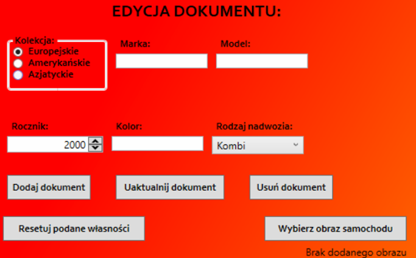
2. Część odpowiedzialna na odczytywanie całych kolekcji bazy danych oraz pobieranie 
pojedynczego dokumentu z tej kolekcji (przy pobraniu dokumentu pojawia się tekst 
zawierający czas jaki zajęło aplikacji na wykonanie lub pobranie poszczególnych 
elementów dokumentu).
 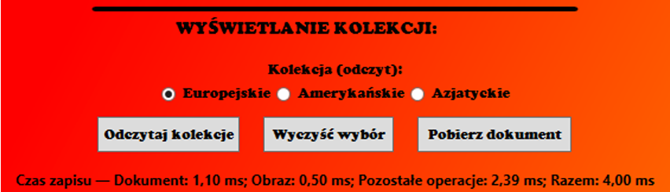
3. Wizualna prezentacja wybranej kolekcji i dokumentów w niej zawartych.
 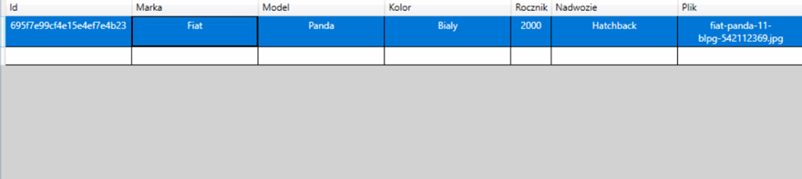
4. Okienko pokazujące obraz wybranego dokumentu (jeżeli ten istnieje w owym dokumencie)
 
 Program pozwala użytkownikowi na wpisanie poszczególnych atrybutów dokumentu w 
wyznaczonych do tego polach (marka, model, kolor itd.) oraz przy użyciu przycisków typu 
“RadioButton” wybranie, do jakiej konkretnie kolekcji ma trafić dany dokument (samochód 
europejski, amerykański czy azjatycki). 
 Po wpisaniu tych atrybutów (gdzie nie każdy musi być wpisany!) użytkownik ma możliwość 
dodania dokumentu (o czym program informuje stosownym komunikatem o sukcesie lub 
problemie, jeżeli taki wystąpi) do wybranej wcześniej kolekcji. 
 Usuwanie dokumentów przez użytkownika działa na zasadzie wybrania konkretnego 
dokumentu z wizualnego okna i po kliknięciu “Usuń dokument”, dokument nie zostaje fizycznie 
usunięty z bazy (dalej istnieje), lecz zmienia się jego atrybut “usunięty” na wartość “true”, przez co przy kolejnym odczytaniu danej kolekcji, dokument posiadający taką wartość w polu 
“usunięty” nie zostanie pokazany w wizualnym oknie do prezentacji dokumentów, a jeżeli 
użytkownik spróbuje usunąć dokument bez wybrania konkretnego dokumentu z listy, program 
pokaże komunikat o błędzie. 
 Uaktualnianie dokumentu polega na tym, że użytkownik (wybierając odpowiedni dokumentu, 
jaki chce zaktualizować - jeżeli nie wybierze pojawi się błąd) może zaktualizować dowolną 
rubrykę w programie i po kliknięciu “Uaktualnij dokument” zostanie on uaktualniony w bazie 
danych. 
 Przycisk “Wybierz obraz samochodu” daje możliwość użytkownikowi wybrania obrazu z 
dowolnego miejsca w swoim komputerze i dołączenia go do konkretnego dokumentu. 
Przyciski “Resetuj podane własności” oraz “Wyczyść wybór” działają na podobnej zasadzie, z 
tym że “Wyczyść wybór” poza danymi czyści również zaznaczenie na dokumencie. 
Użytkownik może za pomocą przycisku “Odczytaj kolekcję” odczytać odpowiednią kolekcję, 
którą wybrał (nawet jak jest ona pusta). 
 Ostatnią możliwością dostępną dla użytkownika jest pobranie wskazanego dokumentu. 
Domyślnie pobiera on dokument oraz obraz (jeżeli taki jest w dokumencie) na pulpit, ale jeżeli 
użytkownik nie zaznaczył żadnego dokumentu, program pokaże komunikat o błędzie.
# <ins>Prezentacja wyników działania programu:
* Dodanie dokumentu z takimi danymi: Marka - Mazda, Model - CX-5, Kolor - Czerwony, 
Rocznik - 2022, Rodzaj Nadwozia - Kombi, Kolekcja - Azjatyckie (dodane również 
zdjęcie)
 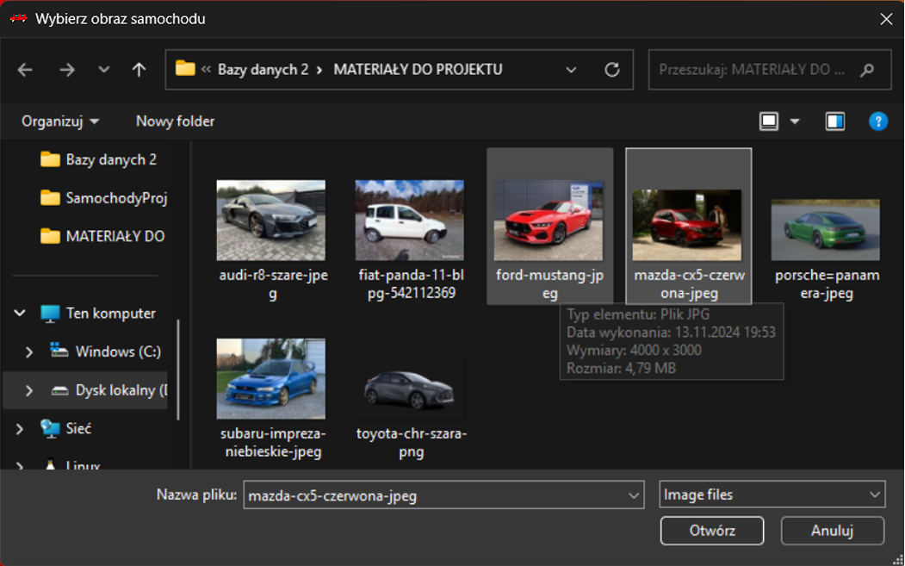
 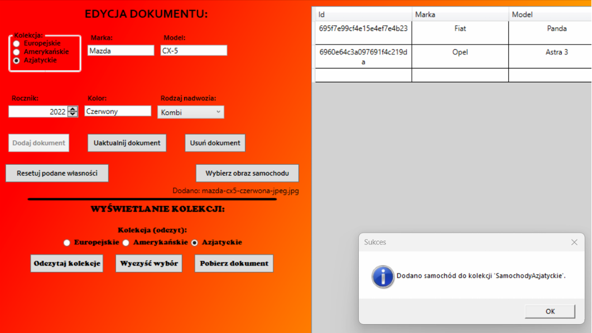
* Odczytanie kolekcji “Azjatyckie” w celu weryfikacji poprawności dodania dokumentu do 
tej kolekcji.
 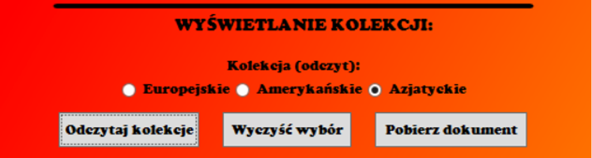
 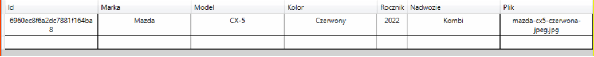
* Próba uaktualnienia dokumentu w celu zmiany rocznika (bez uprzedniego wybrania 
konkretnego dokumentu!)
 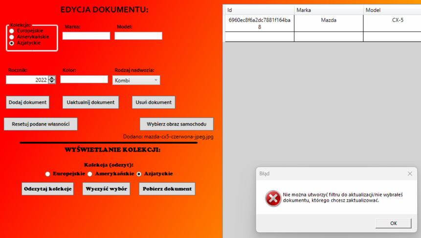
* Wyświetlenie kolekcji dotyczącej samochodów europejskich
 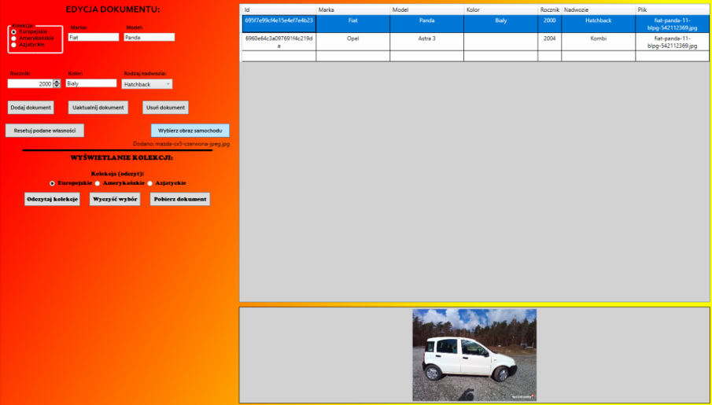
* Uaktualnienie rocznika Mazdy CX-5 na 2020
 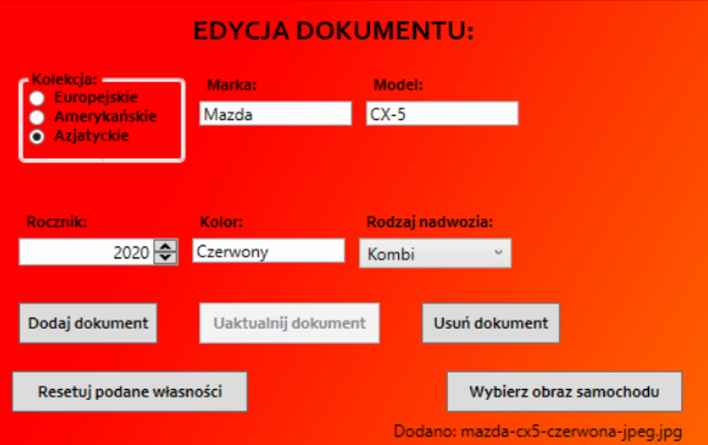
 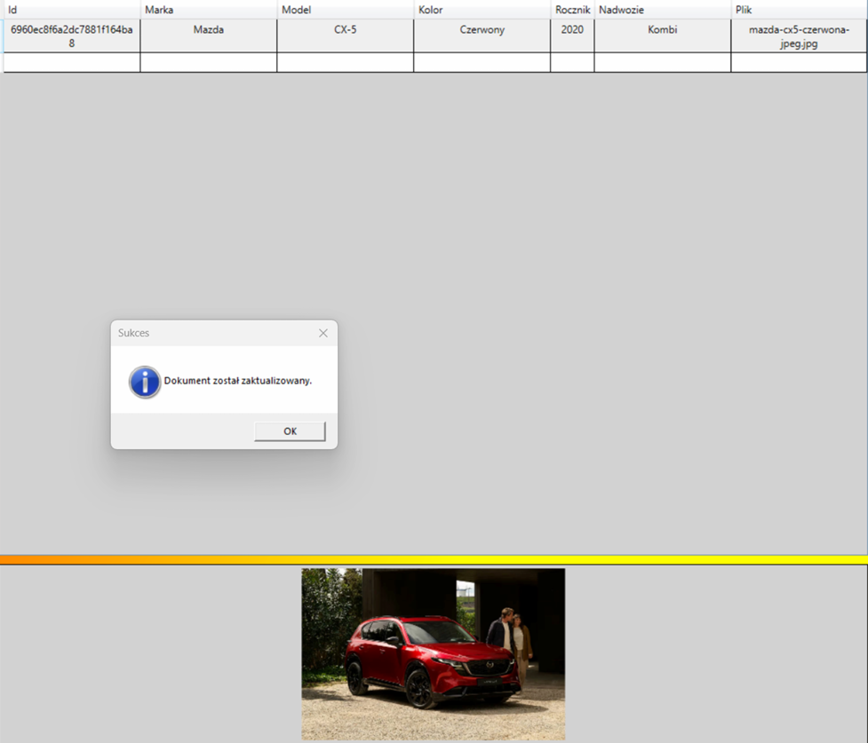
* Zaktualizowanie dokumentu z kolekcji samochodów europejskich o zdjęcie oraz kolor, 
który jest “pusty”
 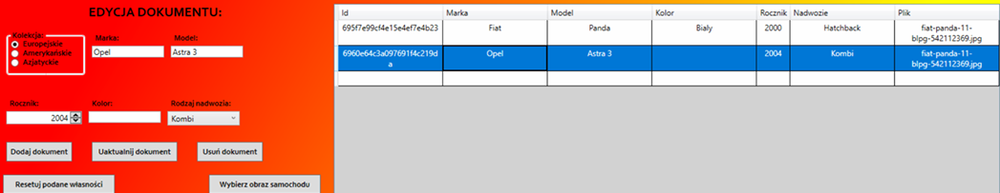
 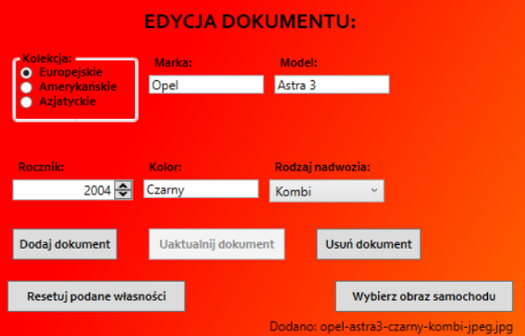
 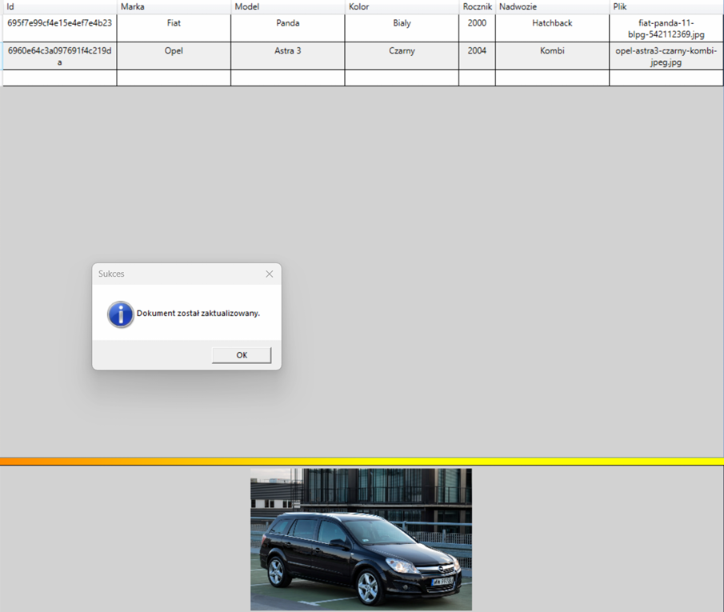
* Próba usunięcia dokumentu z kolekcji samochodów europejskich bez wybrania 
konkretnego dokumentu (błąd!)
 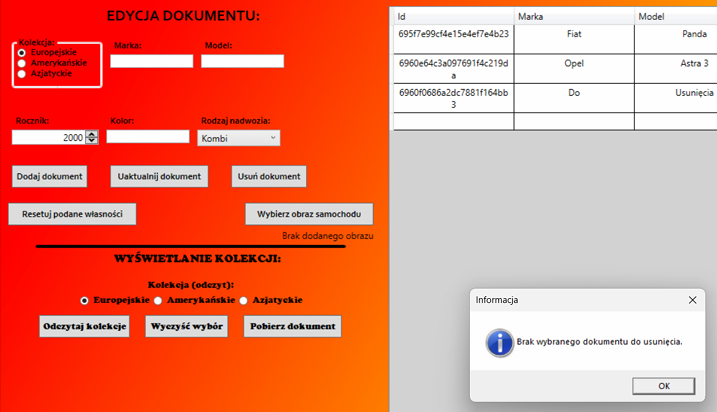
* Pobranie wybranego dokumentu oraz obrazu z tego dokumentu na pulpit
 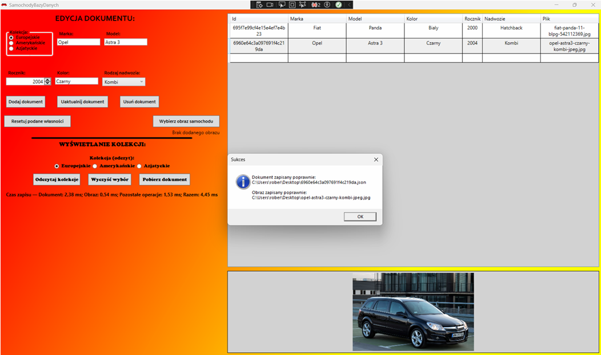
 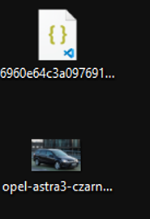
* Usunięcie dokumentu o bezsensownych atrybutach (np. Marka - Do, Model - Usunięcia, 
Kolor - Brzydki itd.) oraz wyświetlenie zaktualizowanej kolekcji oraz pokazanie, że 
dokument usunięty dalej istnieje w bazie danych, ale została mu zmieniona wartość flagi 
“usunięty” na “true”
 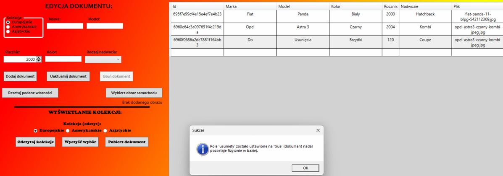
 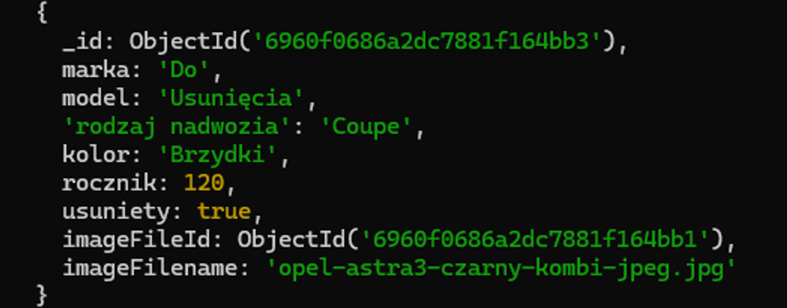
 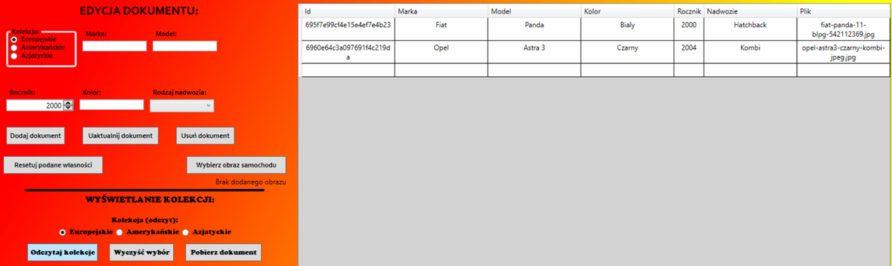
# <ins> Odniesienie do źródeł zewnętrznych (Bibliografia)
* [Artykuł o rodzajach nadwozia w samochodach - AutoHero](https://www.autohero.com/pl/porady-kupna/rodzaje-nadwozia/)
* [Extended Wpf Toolkit (dokumentacja)](https://xceed.com/documentation/xceed-toolkit-plus-for-wpf/)
* Grafiki do dokumentów: Google grafika
* [Introduction to the MVVM Community Toolkit](https://learn.microsoft.com/en-us/dotnet/communitytoolkit/mvvm/)
* [Microsoft Windows WPF (dokumentacja)](https://learn.microsoft.com/en-us/dotnet/desktop/wpf/)
* [MongoDB (dokumentacja)](https://www.mongodb.com/docs/)
* [MongoDB C# Driver (dokumentacja)](https://www.mongodb.com/docs/drivers/csharp/current/)
* [Use a MongoDB database in Windows app](https://learn.microsoft.com/en-us/windows/apps/develop/data-access/mongodb-database)
* [Wzorzec MVVM w aplikacjach WPF - Prof. Jacek Matulewski](https://www.youtube.com/watch?v=mOEBdZlcTvk&list=PLJpfWFOjv2_kIIvHqRPoP4qaAmtcA2Wa_)
